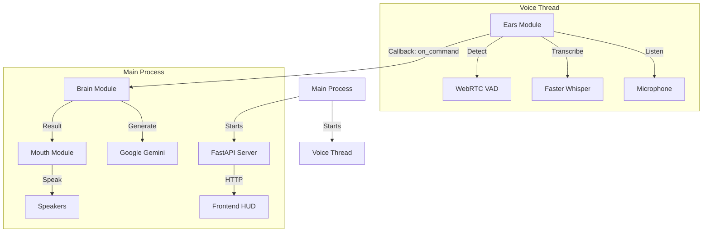

# 🎤 Voice Integration Complete

**Date**: November 19, 2025  
**Status**: ✅ Complete

---

## 🎯 Overview

The Voice Input System (`Ears`) has been successfully integrated into the main AURA application. The system now supports:
1.  **Hands-free Wake Word**: "Jarvis" (and variations like "Jarvis", "Aurora").
2.  **Voice Commands**: Natural language commands processed by the Brain.
3.  **Voice Response**: Spoken responses via Piper TTS (`Mouth`).
4.  **Concurrent API**: The FastAPI server runs alongside the voice loop, allowing the Frontend HUD to work simultaneously.

---

## 🏗️ Architecture

The integration uses a **Threaded Architecture** managed by FastAPI's lifespan events.



---

## 🚀 How to Run

Simply run the main script. It will start both the API server and the Voice Assistant.

```bash
python main.py
```

You should see logs indicating both systems are active:
```text
INFO:     Started server process [12345]
INFO:     Waiting for application startup.
INFO:     Starting Voice Assistant thread...
INFO:     🎧 Starting voice input system (VAD Enabled)...
INFO:     💡 Say one of these to wake: jarvis
INFO:     Application startup complete.
```

---

## 🛠️ Configuration

### **1. Wake Word**
Edit `settings/config.yaml`:
```yaml
wake_word:
  enabled: true
  primary_words: ["jarvis", "aura"]
  similarity_threshold: 0.65
```

### **2. Whisper Model**
We are currently using `large-v3` for maximum accuracy on your RTX 4060.
```yaml
whisper:
  model_size: "large-v3"
  device: "cuda"
  compute_type: "float16"
```

### **3. Hallucination Filter**
To prevent the AI from responding to silence with "Thank you", we implemented a smart filter in `core/ears.py`.
- **VAD (Voice Activity Detection)**: Aggressively filters out non-speech noise.
- **Phrase Filter**: Ignores low-confidence detections of "Thank you", "You", "Bye".

---

## 🧪 Troubleshooting

**Issue: "It ignores me when I say Thank You"**
- **Cause**: The hallucination filter is working. It ignores "Thank you" if the confidence is low or if it's the *only* thing said while in Standby mode.
- **Fix**: Say "Thank you Jarvis" or "Thank you for the help" to bypass the filter.

**Issue: "It's slow to respond"**
- **Cause**: The `large-v3` model takes ~1 second to transcribe.
- **Fix**: Switch to `distil-large-v3` or `medium.en` in `config.yaml` for faster response times.

**Issue: "CUDA Error / Out of Memory"**
- **Cause**: Other apps using GPU VRAM.
- **Fix**: Switch `device: "cpu"` and `compute_type: "int8"` in `config.yaml` (will be slower).
