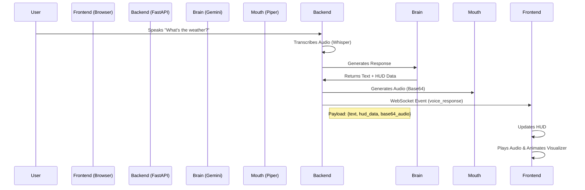

# 🔄 WebSocket & Unified Voice Pipeline Update

**Date**: November 19, 2025  
**Status**: ✅ Deployed

---

## 🎯 Overview

We have successfully refactored the AURA architecture to use a **Unified Audio Pipeline**. Previously, voice commands were processed entirely on the backend with local audio playback, while text commands used the frontend. Now, **ALL** audio output is routed through the Frontend via WebSockets.

This ensures:
1.  **Visualizer Synchronization**: The 3D ball always reacts to AURA's voice, whether triggered by text or speech.
2.  **Echo Prevention**: The backend no longer plays audio locally, preventing the microphone from picking up the response.
3.  **Remote Capability**: The system can now work if the backend is on a server and the frontend is on a different device (e.g., phone/tablet).

---

## 🏗️ New Architecture



---

## 🔌 WebSocket API

**Endpoint**: `ws://localhost:8000/ws`

### Events

#### 1. `voice_response`
Sent when a voice command is processed.
```json
{
  "type": "voice_response",
  "response": "It is currently 25 degrees...",
  "hud_sections": [...],
  "base64_audio": "UklGRi..."
}
```

#### 2. `state_change`
Sent to update the visualizer state.
```json
{
  "type": "state_change",
  "state": "listening" | "processing" | "speaking" | "idle",
  "wake_word": "jarvis" // Optional
}
```

---

## 💡 Smart Light Tool Update

We fixed a critical issue where WiZ smart lights would change IP addresses after a power cycle, breaking the integration.

**Fix Implemented**:
- **Auto-Discovery**: If a light command fails, the system automatically scans the network.
- **Dynamic IP Update**: The controller updates the internal IP registry with the new address.
- **Retry Mechanism**: The failed command is immediately retried with the new IP.

---

## 🧪 Testing the Update

1.  **Start the Backend**:
    ```bash
    python main.py
    ```
2.  **Open Frontend**:
    Open `http://localhost:8000` (or your local file path).
3.  **Voice Command**:
    Say *"Jarvis, turn on the lights"*.
    - **Expected**: Visualizer turns blue (Listening) -> Purple (Processing) -> Blue/Green (Speaking).
    - **Expected**: Audio plays from the **Browser**.
    - **Expected**: Light turns on (even if IP changed).
